<!-- ===================================================== -->
<!--                     VAIBH37                           -->
<!-- ===================================================== -->

<div align="center">



<br/>

<a href="https://git.io/typing-svg">

</a>

<br/>


<br/><br/>


</div>

<br/>

---

<div align="center">

## `// ABOUT`

</div>

<br/>



<br/>

I build things for the web and learn by actually making them work.

My main direction is **full-stack development with MERN**, while gradually going deeper into **backend systems, databases, modern frontend development, and AI**.

I like understanding the complete path from an idea to something people can actually use.

<div align="center">

### `idea → architecture → code → bugs → debugging → understanding → better code → ship`

</div>

<br/>

I'm interested in becoming capable enough to take increasingly difficult ideas and turn them into working software.

<br/>

---

<div align="center">

## `// SYSTEM MODULES`

### Technologies I'm working with, improving, and exploring

<br/>


<br/><br/>


<br/><br/>


</div>

<br/><br/>

<div align="center">

### WEB


<br/><br/>

### FRONTEND


<br/><br/>

### BACKEND


<br/><br/>

### DATA


<br/><br/>

### PROGRAMMING


<br/><br/>

### TOOLING


</div>

<br/>

---

<div align="center">

## `// CURRENT VECTOR`

</div>

```text
01 ───────────────────────────────► JavaScript
     stronger fundamentals

02 ───────────────────────────────► React / Next.js
     modern frontend development

03 ───────────────────────────────► Node / Express
     backend systems & APIs

04 ───────────────────────────────► Databases
     MongoDB • PostgreSQL • MySQL • Redis

05 ───────────────────────────────► AI
     integrations • APIs • intelligent products

06 ───────────────────────────────► Engineering
     better structure • better decisions • better software
```

<br/>

<div align="center">


</div>

<br/>

---

<div align="center">

## `// HOW I LEARN`

</div>

```text
                       ┌─────────────┐
                       │    IDEA     │
                       └──────┬──────┘
                              │
                              ▼
                       ┌─────────────┐
                       │    BUILD    │
                       └──────┬──────┘
                              │
                              ▼
                       ┌─────────────┐
                       │    BREAK    │
                       └──────┬──────┘
                              │
                              ▼
                       ┌─────────────┐
                       │    DEBUG    │
                       └──────┬──────┘
                              │
                              ▼
                       ┌─────────────┐
                       │ UNDERSTAND  │
                       └──────┬──────┘
                              │
                              ▼
                       ┌─────────────┐
                       │   IMPROVE   │
                       └──────┬──────┘
                              │
                              ▼
                       ┌─────────────┐
                       │    SHIP     │
                       └──────┬──────┘
                              │
                              └──────────────► REPEAT
```

<div align="center">

### Every build should make the next build better.

</div>

<br/>

---

<div align="center">

## `// GITHUB TELEMETRY`

<br/>


<br/><br/>


<br/><br/>


</div>

<br/>

---

<div align="center">

## `// CONSISTENCY`

<br/>


</div>

<br/>

---

<div align="center">

## `// CONTRIBUTION ENGINE`

<br/>

<picture>

<source
media="(prefers-color-scheme: dark)"
srcset="https://raw.githubusercontent.com/Vaibh37/Vaibh37/output/github-snake-dark.svg"
/>

<source
media="(prefers-color-scheme: light)"
srcset="https://raw.githubusercontent.com/Vaibh37/Vaibh37/output/github-snake.svg"
/>


</picture>

</div>

<br/>

---

<div align="center">

## `// PRINCIPLES`

</div>

```javascript
const principles = {

    build: "Don't stop at tutorials.",

    learn: "Understand what the code is doing.",

    debug: "Errors are part of the process.",

    improve: "The next version should be better.",

    ship: "Working software beats unfinished ideas.",

    repeat: true

};
```

<br/>

---

<div align="center">

## `// REPOSITORIES`

The README introduces the developer.

The repositories show the work.

<br/><br/>

<a href="https://github.com/Vaibh37?tab=repositories">

</a>

</div>

<br/>

---

<div align="center">

## `// CONNECTION`

<br/>

<a href="https://github.com/Vaibh37">

</a>

<a href="mailto:vaibhavsarda.dev@gmail.com">

</a>

<br/><br/><br/>

```text
╔══════════════════════════════════════════════════════════╗
║                                                        ║
║              BUILDING THE NEXT VERSION                 ║
║                                                        ║
║                   VAIBH37 // ONLINE                    ║
║                                                        ║
╚══════════════════════════════════════════════════════════╝
```

</div>
